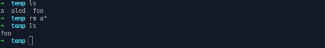

# Utilisation basique d'un terminal

## Objectif

Apprendre à un nouvel utilisateur comment manipuler et naviguer dans le système de fichiers (filesystem) depuis le terminal d'un OS de type UNIX (mac OS et Linux entre autres).

## Pourquoi

Le terminal est l'outil de base de la programmation. Même s'il est souvent possible d'éviter son utilisation, une maîtrise instinctive de celui-ci évite beaucoup de problèmes, notamment ceux liés au développement.
Ce tutoriel en particulier facilitera grandement la prise en main de git.

## Prérequis

* Aucun sur Linux et mac OS
* Sur Windows, git bash qui vient avec l'installation de git ou tout équivalent. Powershell n'est pas un équivalent.

## Qu'est-ce que le système de fichiers

Il est composé de deux types d'éléments : les dossiers et les fichiers.
Il forme donc un arbre avec les dossiers constituant les nœuds et les fichiers les feuilles :


Dans le cas d'un système UNIX, on distingue 2 racines :

La première '/' est celle de tout l'ordinateur, c'est simplement le dossier qui contient tous les autres.

La deuxième 'User' notée '/home/User' ou '~' est celle de la session. C'est celle qui est intéressante en tant qu'utilisateur.

## Naviguer dans le filesystem

### PWD

La première étape est de savoir où l'on est, la commande pwd l'indique. Il faut donc écrire ```pwd``` dans le terminal puis appuyer sur entrée. L'ordinateur devrait afficher une ligne, qui constitue le retour de la commande.

> Je recommande grandement de tester au fur et à mesure chacune des commandes montrées.


Le retour '/home/user42' indique que je suis dans le dossier user42 qui se trouve lui-même dans le dossier home qui est à la racine.
user42 étant mon nom d'utilisateur, je suis en réalité a ~ (racine de ma session), la location par défaut a l'ouverture d'un terminal.
Ce retour changera en fonction de l'OS et du nom d'user.
On dit que le retour de pwd est le dossier courant.

### LS

La commande ls liste le contenu de dossiers :


* Sans argument affiche le dossier courant.
* Un ou plusieurs dossiers peuvent être affiches.

L'option -a permet d'afficher tous les éléments, même ceux qui sont caches (Dont le nom commence par un '.') :


* Le dossier '..' représente le dossier parent.

* Le dossier '.' représente le dossier lui-même.

Les fichiers ou dossiers caches servent souvent à configurer des logiciels, on les précède d'un point pour éviter qu'ils ne polluent ls. Essayer ```ls ~``` puis ```ls -a ~``` par exemple.

L'option -l permet d'afficher une courte description des éléments :


* Cette option donne beaucoup d'informations, la plus importante étant le type d'élément (fichier ou dossier) indique par la présence ou absence du 'd' au début de la ligne.
* On peut combiner les options de cette manière.

ls possède de nombreuses autres options, de manière générale toutes les commandes linux sont détaillées dans des "pages de manuels" accessibles sur internet et depuis le terminal via la commande man : ```man ls``` par exemple.

### Les chemins

Un chemin est une suite de noms de dossiers séparés entre eux par un '/'.
Un chemin peut se terminer par un fichier.

Il existe 2 types de chemins :

* chemin absolu : commence par '/' il indique l'enchainement de dossiers depuis la racine vers l'élément. pwd affiche un chemin absolu vers le dossier courant.
* chemin relatif : l'enchainement de dossiers depuis un dossier vers un élément, potentiellement cela peut être juste le nom dudit élément si celui-ci se situe juste dans le dossier de départ.

Les commandes acceptent les deux et il convient d'utiliser le plus court en fonction de la situation.

Le dossier '..' est souvent utilisé dans les chemins relatifs. ```ls ..``` liste le dossier parent, ```ls ../..``` liste le dossier parent du dossier parent etc.

### CD

cd change de dossier courant :


* on peut utiliser le chemin relatif ou absolu.
* sans argument est équivalent a ```cd ~```.
* ```cd -``` renvoie au dernier dossier courant.

on peut aussi remonter le filesystem via le dossier '..':


* ```cd .``` fonctionne, mais ne fait rien.

A ce point du tutoriel, on devrait être capable de naviguer et se repérer dans filesystem avec la combinaison de commandes cd, ls et pwd : ls permet de repérer les dossiers dans lesquels on veut se déplacer.

Un bon exercice de prise en main serait de descendre de dossier en dossier à l'aide de ```cd``` depuis ~ jusqu'a ce qu'on ne puisse plus aller plus loin, puis de remonter.

### MKDIR

mkdir crée un ou plusieurs dossiers.


* on peut créer un dossier n'importe ou grâce aux chemins.

### TOUCH

touch crée un ou plusieurs fichiers similairement a mkdir.

touch permet en réalité de faire plus que cela, les intéressés peuvent lire le ```man touch```.

### RMDIR

rmdir supprime un dossier s’il est vide.


* 'b' a été supprime parce qu'il était vide, 'a' en revanche existe toujours et n'a pas été change.

### RM

rm supprime un ou plusieurs éléments :


* rm peut supprimer les dossiers même s'ils ne sont pas vides avec l'option '-r', le shell demande alors parfois une confirmation.
* Il est possible de ne pas avoir à confirmer avec l'option '-f'.


* '*' représente n'importe quel nombre de n'importe quels caractères.
* si plusieurs fichiers répondent a la description, ils seront tous affectes par la commande ici tous les fichiers dont le nom commence par a sont supprimés.

Le pattern matching, si bien utilise, est un des principaux avantages du terminal sur l'interface graphique.

### CAT

cat affiche un fichier :


* Si aucun fichier n'est passe en argument cat lit indéfiniment sur l'entrée standard.
* On peut interrompre n'importe quel processus en appuyant simultanément sur Ctrl et C dans le terminal.

### CP

cp est une commande un peu plus complexe.

On distingue deux cas :

1) Copie d'un fichier en un nouveau fichier identique :


* On peut voir que le contenu de file a été copié lorsqu'on affiche le nouveau fichier

2) Copie de plusieurs fichiers dans un dossier :


Il est également possible copier des dossiers avec l'option -r

### MV

mv est similaire à cp à la différence qu’il supprime les éléments originaux après les avoir copiés.
mv peut être utilisé avec des dossiers sans l'option -r.


* Ceci est un exemple d'une réorganisation d'un dossier de projet en utilisant un terminal

## Édition de fichiers

Il existe quelques éditeurs de texte intégrés au terminal, le plus connu étant vim. Similairement a un terminal, ils demandent une certaine maitrise avant de se révéler utiles.

Il reste donc plus simple de coder avec un éditeur de texte à interface graphique.

Visual Studio code par exemple s'ouvre depuis le terminal avec la commande ```code [dossier_de_travail]```, il est facile a prendre en main et possede des integrations qui facilitent grandement l'utilisation de git.

## Execution de scripts

Un script est un fichier contenant un code dans un language interpreté. Ce fichier n'est donc pas un binaire (fichier ne contenant que des 0 ou des 1 et il ne peut donc etre directement compris par la machine. Pour exécuter ledit fichier il faut recourir a un interpreteur qui est lui un binaire et prend en argument le ou les fichiers a interpreter.
exemple "```python <programm name>

## Conclusion

Le terminal et son langage le bash sont beaucoup plus puissants que ce qui a été abordé. Les commandes étudiées devraient toutefois être suffisantes pour apprendre git.
